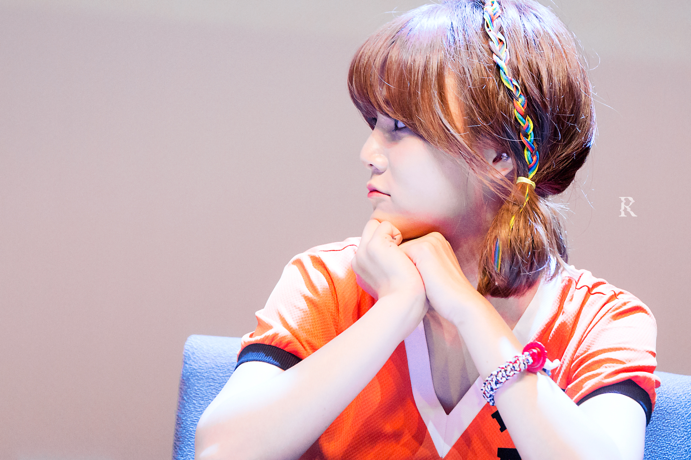

环境:
### MAC OS + VScode + GO

描述:
#### 1,识别出指定目录下的图片中的人脸
#### 2,截出人头保存下来
#### 3,添加sqlite记录

未完成: (求大神帮忙补上)
#### 4,根据存储的人脸数据,把新检测出的人脸对号入座

基于dlib 和 opencv-haar 的人脸识别
项目内实现了两种方式, 作对比用.


```
自己私人数据
//dlib  204/204
//_alt_tree.xml 准确率很高, 识别率太低 可用/识别出 99/99
//_alt.xml 偏中等,识别率还可以, 237/500+
//_alt2.xml 准确率太低, 识别率不错 250/900+
//_default.xml  270/3000+
```

```
项目内测试数据
|方式           |正确数/识别数|            
|dlib           |41/41|
|alt_tree       |14/14|
|alt            |36/42|
|alt2           |36/44|
|default        |39/88|
```

正常应该要43+的人脸
这两侧脸都没一家识别出来



###### 声明:以上测试结果仅凭自己小量数据测试得出,不代表任何官方结果,可自行大量数据测试.